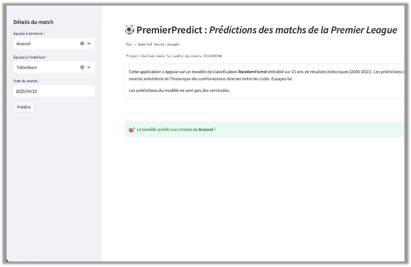

# PremierPredict

## Prédiction des matchs de football de la Premier League anglaise

**PremierPredict** est une application web interactive permettant de *prédire les résultats des matchs de la Premier League anglaise*. Le projet s'appuie sur un modèle d'apprentissage automatique entraîné sur *25 ans de données historiques (2000-2025)*.

Nous avons déployé le modèle prédictif que nous avons conçu au terme du projet sous la forme d'une application web, pour permettre de prédire les résultats de différents matchs! 

#### L'application est disponible au lien suivant. **Essayez-là ! : [PremierPredict](https://foot-forecast.streamlit.app)**

## Fonctionnalités

- Prédiction des résultats de matchs (victoire à domicile, victoire à l'extérieur, match nul)
- Indication du pourcentage de confiance dans la prédiction
- **Interface utilisateur** simple et intuitive
- Prise en compte de **multiples facteurs** pour les prédictions :
  - *Forme* récente des équipes
  - *Statistiques de buts* (marqués/encaissés)
  - *Historique des confrontations* directes
  - *Facteurs* temporels (semaine de la saison, mois)

## Architecture du projet

- `app.py` : Application Streamlit pour l'interface utilisateur
- `notebook_functions.py` : Fonctions utilisées pour les prédictions. **L'entièreté des fonctions utilisées sont exactement les mêmes que celles crées dans le notebook** `epl_predictor.ipynb`  et ont été recrées dans un fichier `.py` pour permettre l'intégration auprès de l'application *Streamlit*
- `epl_predictor.ipynb` : Notebook Jupyter détaillant le développement du modèle et de l'entièreté du projet
- `epl_2000-2025.csv` : Jeu de données des matchs de Premier League regroupant $9318$ matchs de $2000$ à $2025$
- `variables_def.md` : Explication des variables explicatives utilisées comme intrants au modèle prédictif
- `column_def.txt` : Définitions des colonnes du jeu de données initial `epl_2000-2025.csv`
- `xgb_model.pkl` : Modèle XGBoost entraîné
- `requirements.txt` : Dépendances utilisées

## Technologies utilisées

- **Python** : Langage de programmation principal
- **Streamlit** : Framework pour l'interface web
- **Pandas** : Manipulation et analyse des données
- **XGBoost** : Algorithme d'apprentissage automatique
- **Matplotlib/Seaborn** : Visualisation des données

## Performance du modèle

Le modèle XGBoost atteint une précision d'environ 48% sur l'ensemble de test, ce qui est significativement supérieur au hasard (33% pour un problème à trois classes).

## Contexte académique

Projet réalisé dans le cadre du cours TECH20704 par :
- Gabriel Hardy-Joseph
- Louis-Matteo Creplet
- Mohamed-Aziz Charfeddine
- Karim Ghandour

## Limitations

- Les prédictions sont basées sur des données historiques et ne peuvent pas prendre en compte tous les facteurs imprévisibles (blessures de dernière minute, conditions météorologiques, etc.)
- Le modèle éprouve une difficulté considérable à prédire les matchs nuls ce qui limite de façon importante ses performances